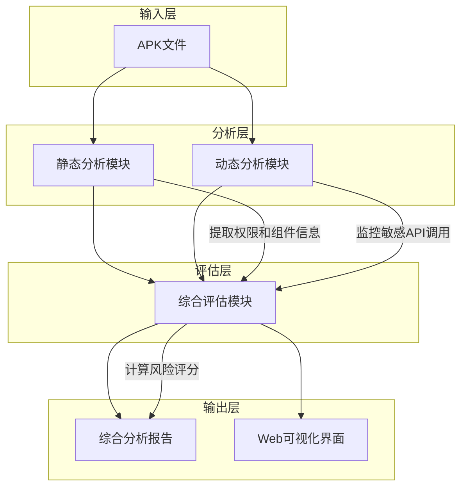

# 第三章 系统设计与方案

## 3.1 总体设计思路与架构

本系统采用分层流水线架构，实现了从APK输入到风险评估报告输出的完整分析流程。系统由三个核心模块组成：静态分析模块、动态分析模块和综合评估模块，它们协同工作形成一个完整的分析体系。

### 系统架构流程图

### 模块功能说明

1. **静态分析模块**：负责解析APK文件，提取权限、组件等信息，并分析权限风险等级。
2. **动态分析模块**：基于ADB和Frida进行运行时监控，包括应用启动、用户交互模拟、敏感API调用监控等。
3. **综合分析模块**：整合静态和动态分析结果，计算风险评分，生成综合分析报告。
4. **Web可视化模块**：使用Flask和Chart.js展示分析结果，提供直观的风险评估界面。

## 3.2 核心模块设计

### 3.2.1 静态分析模块

静态分析模块基于Androguard库实现APK文件的解析和分析，主要功能包括：

1. **APK解析**：
   - 使用Androguard的`APK`类解析APK文件
   - 提取AndroidManifest.xml中的权限列表和四大组件信息
   - 获取应用包名和版本信息

2. **权限风险分析**：
   - 加载权限风险映射表（从Excel文件）
   - 对每个权限进行风险等级评估
   - 自动检测未在映射表中的权限风险

3. **组件分析**：
   - 提取应用的Activity、Service、Receiver和Provider组件
   - 分析组件的导出状态和权限保护级别

4. **实现细节**：
   - 支持批量分析多个APK文件
   - 生成详细的静态分析报告
   - 处理编码和解析异常

### 3.2.2 动态分析模块

动态分析模块基于ADB和Frida框架实现运行时行为监控，主要功能包括：

1. **设备管理**：
   - 检测设备连接状态
   - 启动Frida服务器
   - 支持多设备连接和设备选择

2. **应用管理**：
   - 安装APK到设备
   - 多种应用启动方式（monkey命令、am start命令等）
   - 模拟用户交互行为

3. **行为监控**：
   - 监控敏感API调用（设备标识、位置、相机等）
   - 获取网络流量、系统资源使用情况
   - 支持多编码处理解决日志编码问题

4. **Frida动态Hook**：
   - **Attach模式**：用于已运行的应用，解决加固应用的反调试问题
   - **Spawn模式**：用于启动新应用，获取完整的启动流程
   - **Gadget模式**：作为备用方案，应对特殊加固场景

5. **反调试与Root检测绕过**：
   - 检测并绕过应用的Root检测
   - 处理应用的反调试机制
   - 提高分析成功率

### 3.2.3 风险评估模型

风险评估模型基于静态和动态分析结果，采用加权评分算法：

1. **风险评分公式**：
   \[\text{TotalScore} = \text{StaticScore} + \text{DynamicScore}\]
   - **静态评分**：\(\text{StaticScore} = \sum (\text{权限风险权重} \times \text{权限数量})\)
   - **动态评分**：\(\text{DynamicScore} = (\text{敏感API调用数} \times 4) + (\text{网络流量异常数} \times 3) + (\text{隐私数据泄露} \times 10)\)

2. **权限权重表**：

| 风险等级 | 权重值 |
|---------|-------|
| 极高     | 5     |
| 高       | 3     |
| 中高     | 2     |
| 中       | 1     |
| 低       | 0.5   |

3. **风险等级判定标准**：

| 风险等级 | 总分范围 | 说明 |
|---------|---------|------|
| 高风险   | ≥ 20    | 存在严重隐私安全问题 |
| 中风险   | 10-19   | 存在中等隐私安全问题 |
| 低风险   | < 10    | 隐私安全问题较少 |

4. **基于GBT+41391-2022标准的权限分类**：
   - 必要个人信息：不计算风险分数
   - 非必要但有关联个人信息：计算风险分数
   - 无关个人信息：不计算风险分数

## 3.3 系统模块功能对比表

| 模块 | 核心功能 | 技术实现 | 输出结果 |
|------|---------|---------|---------|
| 静态分析 | 权限解析、组件分析 | Androguard | 静态分析报告 |
| 动态分析 | 行为监控、API调用追踪 | Frida、ADB | 动态分析报告 |
| 综合评估 | 风险评分、等级判定 | 加权算法 | 综合分析报告 |
| Web可视化 | 结果展示、数据可视化 | Flask、Chart.js | 交互式Web界面 |

## 3.4 关键算法/实验参数的确定

### 风险评分算法

系统采用加权评分算法，综合考虑静态和动态分析结果：

- **静态分析评分**：
  - 基于权限风险等级的权重计算
  - 必要个人信息权限不计算风险分数

- **动态分析评分**：
  - 敏感API调用：每个4分
  - 网络流量异常：每个3分
  - 隐私数据泄露：10分

- **风险等级划分**：
  - 总分 ≥ 20：高风险
  - 总分 ≥ 10：中风险
  - 总分 < 10：低风险

### 实验参数

| 参数 | 值 | 说明 |
|------|-----|------|
| 敏感API监控时长 | 60秒 | 确保捕获足够的API调用 |
| Frida分析时长 | 30秒 | 平衡分析深度和效率 |
| 设备连接重试次数 | 3次 | 提高设备连接成功率 |
| ADB命令超时时间 | 10-120秒 | 根据操作复杂度调整 |
| 应用启动等待时间 | 5秒 | 确保应用完全启动 |
| 用户交互间隔 | 2秒 | 模拟真实用户操作节奏 |

## 3.5 本章小结

本章详细介绍了APP隐私权限检测与风险预警系统的设计与实现方案。系统采用分层流水线架构，包含静态分析、动态分析、综合分析和Web可视化四个主要模块。通过Androguard进行静态分析，ADB和Frida进行动态分析，实现了对Android应用隐私权限使用情况的全面评估。

系统设计考虑了多种实际场景，如设备连接失败、包名提取失败等异常情况，提高了系统的稳定性和可靠性。关键算法和实验参数的确定，确保了分析结果的准确性和一致性。

基于GBT+41391-2022标准的权限分类和风险评估算法，提高了评估的准确性和合理性。系统的Web可视化界面使得分析结果更加直观易懂，便于用户理解和决策。

下一步将通过实验验证系统的有效性，分析实际应用的隐私权限使用情况，并评估系统的性能和准确性。